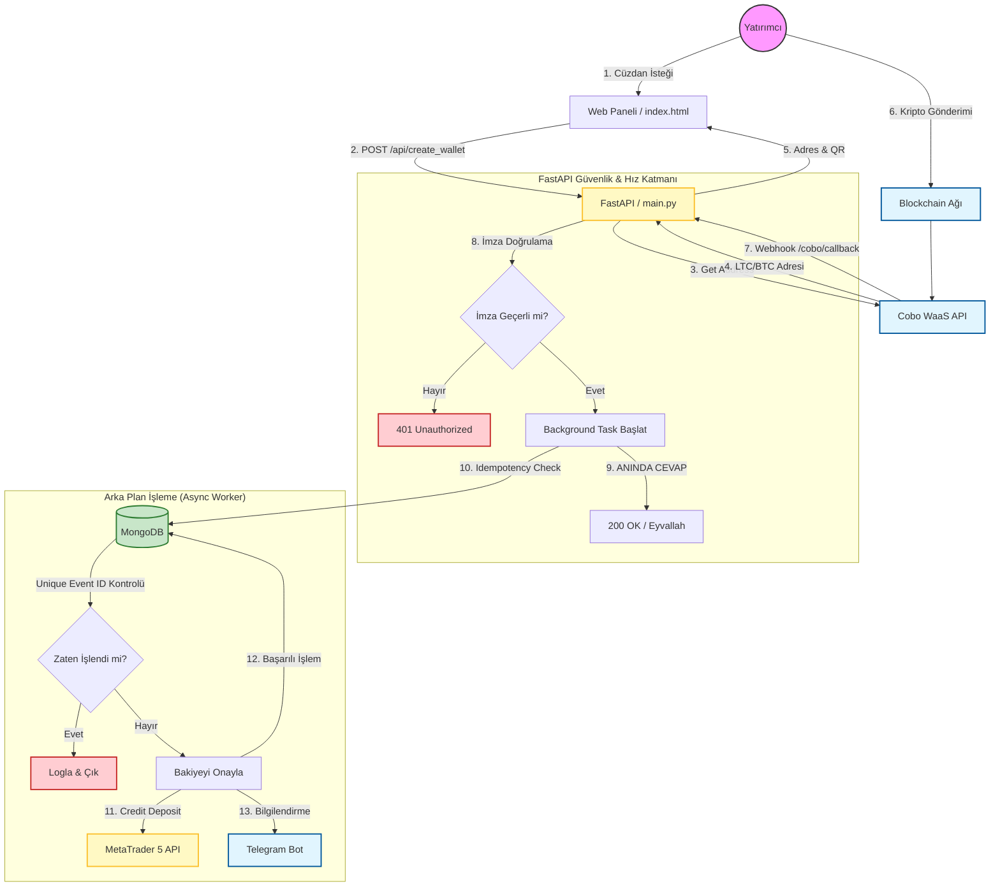

# 🏦 Kripto Ödeme & MT5 Entegrasyon Sistemi (COBO)

Bu proje, Cobo WaaS (Wallet as a Service) API'si ile entegre çalışarak kripto para yatırımlarını yönetir, Mükerrer (Duplicate) işlem koruması sağlar ve MetaTrader 5 (MT5) platformuna otomatik bakiye aktarımı yapar.

## 🌟 Sistem Özellikleri
- **Otomatik Cüzdan Oluşturma:** Kullanıcıya özel USDT (TRC20, ERC20 vb.) adresi üretir.
- **Webhook Entegrasyonu:** Cobo'dan gelen anlık bildirimleri (deposit) işler.
- **Mükerrer İşlem Koruması:** `MongoDB Atomic Lock` ve `Unique Index` ile aynı işlemin birden fazla kez bakiyeye yansımasını %100 engeller.
- **Yüksek Performans:** FastAPI ve PM2 ile Windows sunucuda 7/24 kesintisiz çalışır.
- **MT5 Entegrasyonu:** Yatırımları anında MT5 hesabına `Balance` işlemi olarak yansıtır.

---

## 🏛️ Sistem Mimarisi



---

## 🚀 Kurulum ve Çalıştırma (Windows Server)

Bu proje Windows ortamında en verimli şekilde **PM2** Process Manager ile çalışır. Terminallerin donması veya kapanması sorununu ortadan kaldırır.

### 1. Gereksinimler
- Python 3.10+
- Node.js (PM2 için)
- MongoDB Access
- MetaTrader 5 Terminali (Açık olmalı)

### 2. PM2 ve Node.js Kurulumu (Yönetici Terminali)
Powershell veya CMD'yi **Administrator** olarak açın:
```powershell
# Node.js Kurulumu (Eğer yoksa)
choco install nodejs -y

# PM2 Kurulumu
npm install -g pm2

# Log Yönetimi Eklentisi (Disk dolmaması için)
pm2 install pm2-logrotate
```

### 3. Proje Ayarları (.env)
Proje ana dizininde `.env` dosyasının olduğundan ve tüm API anahtarlarının girili olduğundan emin olun.

### 4. SSL Hatası Çözümü (Önemli!)
Windows sunucularda Python bazen SSL sertifikalarını doğrulayamaz (`CERTIFICATE_VERIFY_FAILED`). 
Kod içinde `certifi` kütüphanesi kullanılarak bu sorun otomatik çözülmüştür. Ekstra işlem gerekmez.

### 5. Sistemi Başlatma (PM2 ile)
Proje klasörüne gidin ve tek komutla her şeyi ayağa kaldırın:

```cmd
pm2 start ecosystem.config.js
```

Bu komut şunları başlatır:
1.  **COBO-API:** Ana Web Sunucusu (`main.py`) - Port 8000
2.  **COBO-MT5-WORKER:** MT5 Senkronizasyon İşçisi (`mt5_worker.py`)

### 6. Yönetim Komutları

| Komut | Açıklama |
|-------|----------|
| `pm2 status` | Çalışan servislerin durumunu gösterir |
| `pm2 logs` | Tüm canlı logları akan yazı olarak gösterir (Çıkış: Ctrl+C) |
| `pm2 restart all` | Tüm sistemi yeniden başlatır |
| `pm2 delete all` | Tüm servisleri listeden siler (Durdurur) |

**Not:** `ecosystem.config.js` dosyası UTF-8 ayarlarını ve Python yolunu otomatik yönetir (`./venv/Scripts/python.exe` kullanır).

---

## 🖥️ Frontend (Arayüzler)

### 1. Yatırımcı Paneli (`index.html`)
Müşterilerin TP numarası ile giriş yapıp:
- Hesap bakiyelerini gördüğü,
- Kripto (USDT, TRON) cüzdanı oluşturduğu,
- QR kod ile ödeme yaptığı ana ekrandır.

### 2. Admin Paneli (`admin.html`)
Yöneticiler için gizli paneldir:
- **URL:** `/admin.html` (Nginx üzerinden sunulur)
- Özellikler: Cüzdan bakiyelerini (Sweep) görme, Para Çekme (Withdrawal) işlemlerini yönetme.

---

## 🔒 Güvenlik Notları
- **Unique Index:** MongoDB üzerinde `transaction_id` alanı **Unique** olarak işaretlenmelidir. Kod bunu `startup` aşamasında otomatik dener (`ensure_transaction_index`).
- **Nginx:** Dış dünyadan gelen istekler Nginx üzerinden Reverse Proxy ile `localhost:8000`'e iletilir.
