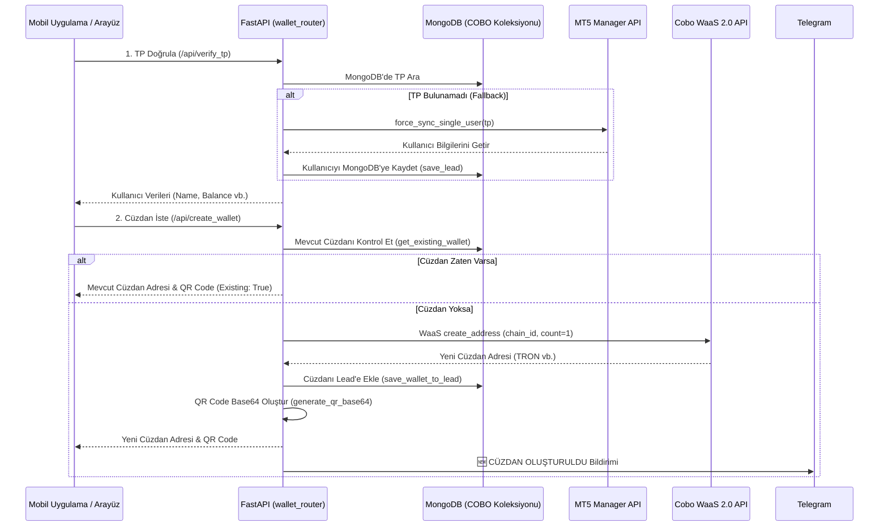

# 🔑 Cüzdan Nasıl Oluşturulur?

Bu rehber, bir müşterinin MT5 hesabına (TP Number) bağlı olarak nasıl kripto cüzdan adresi oluşturulduğunu ve bu sürecin arkasındaki doğrulama mekanizmalarını adım adım açıklamaktadır.

---

## 📋 İş Akış Şeması

---

## 🛠️ Süreç Adımları ve Teknik Detaylar

### Adım 1: TP Numarası Doğrulama (`/api/verify_tp`)
* **Amaç:** Müşterinin geçerli bir MT5 hesabına sahip olup olmadığını ve güncel bakiyelerini doğrulamaktır.
* **Parametre:** `tp_number` (FastAPI Form verisi olarak).
* **İşleyiş:**
  1. API, veritabanından `get_lead_by_tp(tp_number)` fonksiyonu ile kullanıcıyı sorgular.
  2. Eğer kullanıcı MongoDB'de yoksa, **Fallback Mekanizması** devreye girer. `force_sync_single_user(tp_number)` çağrılarak MT5 sunucusuyla anlık bağlantı kurulur ve kullanıcının bilgileri çekilerek yerel DB'ye kaydedilir.
  3. Kullanıcı hala bulunamazsa `404 Not Found` hatası dönülür.
  4. Bulunduğunda ise isim, email, güncel bakiye (balance, equity, credit) ve son senkronizasyon tarihi döndürülür.

### Adım 2: Cüzdan Talebi ve Adres Üretimi (`/api/create_wallet`)
* **Amaç:** Kullanıcıya yatırım yapabileceği benzersiz bir kripto para yatırma adresi sunmaktır.
* **Parametreler:** `tp_number`, `chain_id` (örn: USDT), `asset_name` (örn: USDT).
* **İşleyiş:**
  1. **Ağ Normalizasyonu:** Eğer gelen `chain_id` "USDT" ise, bu değer arka planda `"TRON"` (TRC20 ağı) olarak normalize edilir.
  2. **Mevcut Cüzdan Kontrolü:** `get_existing_wallet` fonksiyonu ile veritabanında bu `tp_number`'a ait, aynı asset ve zincirde (chain_id) daha önce oluşturulmuş bir cüzdan olup olmadığı kontrol edilir.
     * **Varsa:** API, cüzdan oluşturmak için Cobo'ya tekrar istek atmaz. Veritabanındaki adresi alır, QR kodunu (Base64) üretir ve `existing: True` bayrağı ile anında istemciye döner. Bu sayede gereksiz API limit harcamaları engellenir.
  3. **Cobo WaaS 2.0 İletişimi:** Eğer cüzdan yoksa, `cobo_waas2.WalletsApi` üzerinden `create_address` fonksiyonu çağrılır. `COBO_WALLET_ID` parametresiyle Cobo API'sine istek gönderilir.
     * *Not: Windows ve yerel sunuculardaki SSL sertifika sorunlarını önlemek amacıyla `configuration.verify_ssl = False` ayarı uygulanır.*
  4. **MongoDB Güncellemesi:** Cobo'dan dönen yeni cüzdan adresi `save_wallet_to_lead` fonksiyonu ile MongoDB'deki kullanıcının (lead) `wallets` dizisine push edilir.
  5. **QR Üretimi:** Oluşturulan adres için `qr_service` aracılığıyla Base64 formatında QR kodu görsel verisi üretilir.
  6. **Telegram Bildirimi:** Yeni cüzdan başarıyla oluşturulduğunda Telegram grubuna bilgilendirme mesajı gönderilir.

---

## 📢 Telegram Bildirim Şablonu

Cüzdan başarıyla oluşturulduğunda, `webhook_processor.py` üzerinden şu şekilde formatlı bir Telegram bildirimi yayınlanır:

> 🆕 **CÜZDAN OLUŞTURULDU**
>
> 👤 **Müşteri:** Ahmet Yılmaz  
> 🔑 **TP:** `951234`  
> 💵 **Varlık:** USDT  
> 🌐 **Ağ:** TRON (TRC-20)  
> 📍 **Adres:** `TY1u234567890abcdefghijklmnopqrs`

---

## 🔗 İlgili Bağlantılar
* Webhook bildirimlerinin arka planda nasıl işlendiğini görmek için: [[Webhook_Bildirimleri_Nasil_Calisir]]
* Gelen yatırımların onay mekanizmasını incelemek için: [[MT5_Bakiye_Aktarimi_Nasil_Onaylanir]]
* Fiat yatırımların nasıl çalıştığını incelemek için: [[Kullanici_Nasil_Yatirim_Yapacak]]

---
#group/waas #group/mt5 #group/telegram
