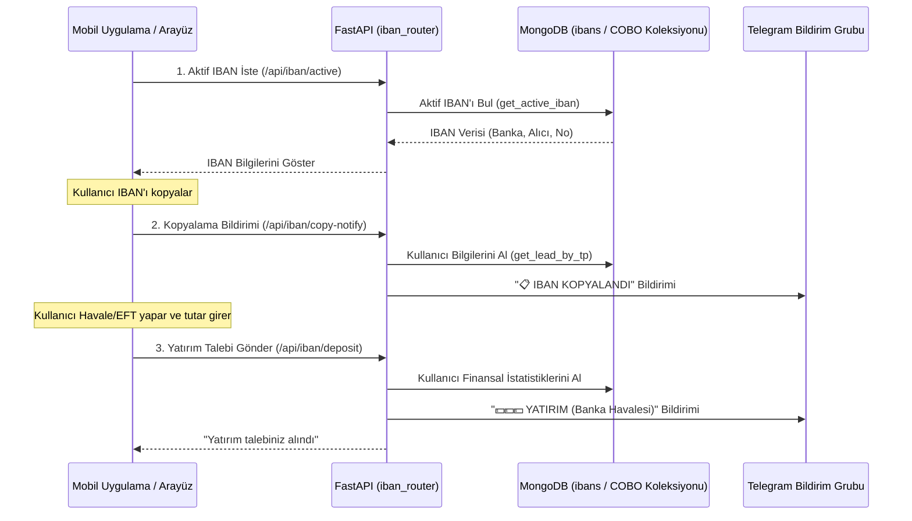

# 💵 Kullanıcı Nasıl Yatırım Yapacak? (IBAN & Havale Süreçleri)

Bu rehber, kullanıcıların banka havalesi (IBAN/Fiat) yoluyla yatırımlarını ve çekimlerini nasıl gerçekleştirdiklerini, bu işlemler sırasında arka planda çalışan API endpoint'lerini ve Telegram bildirimlerini açıklamaktadır.

---

## 📋 İş Akış Şeması (Yatırım Süreci)

---

## 🛠️ Detaylı Süreç ve Teknik İnceleme

### 1. Aktif IBAN Bilgisini Çekme (`/api/iban/active`)
* **Amaç:** Kullanıcıya para gönderebileceği aktif ve geçerli şirket banka hesabını göstermektir.
* **İşleyiş:** API, veritabanından `is_active: True` olan IBAN belgesini çeker.
  * Eğer aktif bir IBAN tanımlanmamışsa `404 Not Found` hatası döner. Mobil arayüz bu durumda uyarı göstererek yatırımları geçici olarak engeller.

### 2. IBAN Kopyalandı Bildirimi (`/api/iban/copy-notify`)
* **Amaç:** Kullanıcının yatırıma niyetlendiğini ve cüzdan/IBAN bilgisini kopyaladığını yatırım uzmanına (Müşteri Temsilcisi) anlık olarak bildirmektir.
* **Parametre:** `tp_number`.
* **Telegram Bildirimi:** Kopyalama işlemi gerçekleştiği an Telegram'a anlık mesaj atılır:
  > 📋 **IBAN KOPYALANDI**  
  > MOBİL UYGULAMA  
  >  
  > **Ad Soyad:** AHMET YILMAZ  
  > **TP NUMBER :** `951234`  
  > **Kopyalanan IBAN:** `TR560006200000000012345678`  
  > **Banka:** GARANTİ BBVA  

### 3. Havale / EFT Yatırım Bildirimi (`/api/iban/deposit`)
* **Amaç:** Kullanıcının banka havalesini tamamladıktan sonra gönderdiği yatırım bildirimini finans ekibine ve yatırım uzmanına iletmektir.
* **Parametreler:** `tp_number`, `tutar`, `doviz`.
* **Detaylar:**
  * Kullanıcı adı, CRM numarası, müşteri temsilcisi adı, departman ve toplam finansal özet (toplam yatırım/çekim) MongoDB'den çekilerek mesaja eklenir.
  * Sayılar Türkiye formatına (`1.000,00` şeklinde) dönüştürülür.
  * Zaman damgası Türkçe ay isimleriyle formatlanır.
* **Telegram Bildirim Şablonu:**
  > 💵💵💵 **YATIRIM** 💵💵💵  
  > MOBİL UYGULAMA  
  > Banka Havalesi  
  >  
  > **Ad Soyad:** AHMET YILMAZ  
  > **Banka:** GARANTİ BBVA  
  > **Alıcı:** CEP PORTFOY A.Ş.  
  > **IBAN:** `TR560006200000000012345678`  
  > **Döviz:** TRY  
  > **Miktar:** 50.000,00 TRY  
  > **Firma Adı:** Anadolu Varlık Yatırım  
  > **CRM NO:** CRM-12934  
  > **MT5 :** `951234`  
  > **Müşteri Temsilcisi:** Engin Öztürk  
  > **Departman:** MAIN  
  > **Ref:** Referans_Bilgisi  
  > **Toplam Yatırım:** 150.000,00  
  > **Toplam Çekim:** 20.000,00  
  > **TALEP ZAMANI:** 04 Haziran 2026 15:30:12  

### 4. Banka Çekim Talebi (`/api/iban/withdrawal`)
* **Amaç:** Kullanıcının banka hesabına para çekme talebi oluşturmasını sağlamaktır.
* **Parametreler:** `tp_number`, `alici_adi`, `alici_iban`, `tutar`, `banka_adi`.
* **Telegram Bildirim Şablonu:**
  > 💸 **BANKA ÇEKİM TALEBİ**  
  > MOBİL UYGULAMA  
  >  
  > **Ad Soyad:** AHMET YILMAZ  
  > **TP NUMBER :** `951234`  
  > **Alıcı Adı:** AHMET YILMAZ  
  > **Alıcı IBAN:** `TR920001500158007301928374`  
  > **Banka:** AKBANK  
  > **Çekim Tutarı:** 10.000,00 ₺  

---

## 🔑 Admin IBAN Yönetim Paneli (`/api/admin/ibans`)

Şirket yetkilileri, kullanıcıların göreceği aktif IBAN'ı yönetmek için HTTP Basic Auth (`authenticate_iban`) korumalı admin endpoint'lerini kullanırlar:
* **IBAN'ları Listeleme (GET):** Sistemde tanımlı tüm aktif ve pasif banka hesaplarını listeler.
* **Yeni IBAN Ekleme (POST):** Yeni bir banka hesabı ekler. Eklenen IBAN varsayılan olarak pasif (`is_active: False`) eklenir. IBAN içerisindeki boşluklar temizlenir ve büyük harfe normalize edilir.
* **IBAN Aktifleştirme (PUT `/ibans/{id}/activate`):** Belirtilen IBAN kaydını aktif eder. **Kural:** Sistemde aynı anda yalnızca 1 adet aktif IBAN bulunabilir. Bu endpoint çağrıldığında, veritabanındaki diğer tüm IBAN'lar otomatik olarak pasife alınır (`is_active: False`).
* **IBAN Pasifleştirme (PUT `/ibans/{id}/deactivate`):** Belirtilen IBAN'ı pasif hale getirir.
* **IBAN Silme (DELETE `/ibans/{id}`):** Belirtilen IBAN kaydını veritabanından tamamen siler.

---

## 🔗 İlgili Bağlantılar
* Kripto cüzdan oluşturma adımlarını incelemek için: [[Cuzdan_Nasil_Olusturulur]]
* Webhook bildirim mekanizmasını görmek için: [[Webhook_Bildirimleri_Nasil_Calisir]]
* MT5 bakiye ekleme ve onay süreçlerini incelemek için: [[MT5_Bakiye_Aktarimi_Nasil_Onaylanir]]

---
#group/fiat #group/telegram
