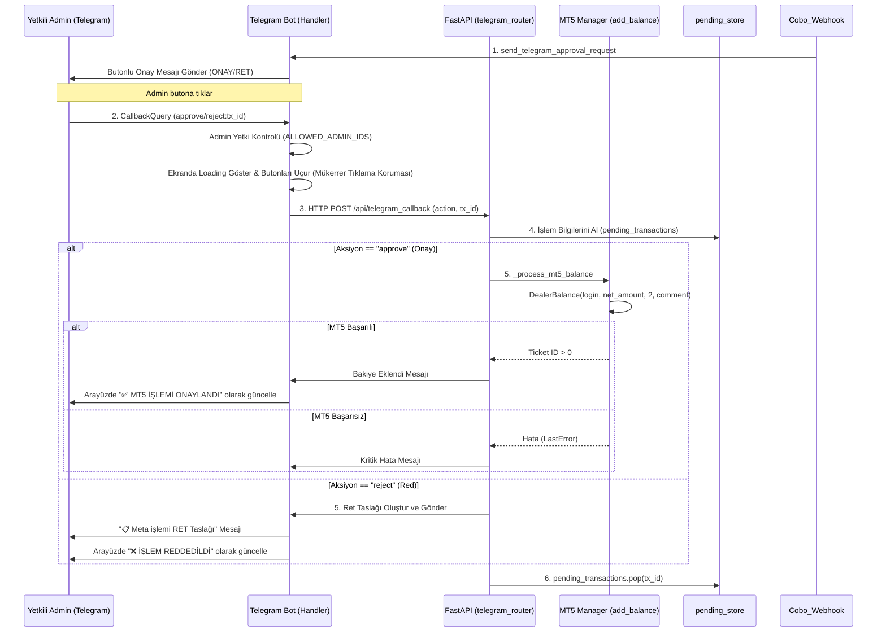

# 💰 MT5 Bakiye Aktarımı Nasıl Onaylanır?

Bu rehber, Cobo webhook'u tarafından yakalanan yatırımların komisyon hesaplamalarını, Telegram onay/ret buton mekanizmasını ve yetkili adminler tarafından onaylandığında MT5 hesabına bakiyenin nasıl eklendiğini açıklar.

---

## 📋 İş Akış Şeması



---

## 🛠️ Detaylı Süreç ve Teknik İnceleme

### 1. Komisyon Hesaplama (`core/comision/calculate_comision.py`)
* Gelen brüt USD tutarı üzerinden komisyon hesaplanır.
* **Komisyon Oranı:** Şu an sistemde `COMISION_RATE = 0` (yüzde olarak %0) tanımlanmıştır. Dolayısıyla komisyon kesilmemekte, brüt miktar doğrudan net miktar olarak MT5'e yansımaktadır. 
* Fonksiyon çıktı yapısı:
  ```json
  {"gross": 1000.0, "comision": 0.0, "net": 1000.0, "rate": 0}
  ```

### 2. Onay Bekleyen Depo (`workers/pending_store.py`)
* Webhook üzerinden başarılı olan ve filtreleri geçen işlemler veritabanına işlendikten hemen sonra, MT5 bakiye aktarımı öncesinde onay aşamasına gelir.
* İşlem detayları RAM tabanlı `pending_transactions` sözlüğünde (dict) geçici olarak depolanır.
* Bu depodaki veriler; TP numarası, net miktar, brüt miktar, coin cinsi, yatırım uzmanı kodu ve MT5 işlem açıklaması gibi tüm metadata detaylarını barındırır.

### 3. Telegram Onay Butonları ve Güvenlik
* Müşterinin yatırımı algılandığında Telegram grubuna **[✅ ONAYLA]** ve **[❌ REDDET]** inline butonlarını içeren bir onay mesajı (`send_telegram_approval_request`) gönderilir.
* **Güvenlik & Yetki Kontrolü (`ALLOWED_ADMIN_IDS`):** Butona basıldığında, basan kullanıcının Telegram ID'si kontrol edilir. Eğer ID listede yoksa, "Yetkiniz yok!" uyarısı verilir ve işlem bloke edilir.
* **Loading ve Çifte Tıklama Koruması (UX/Race-Condition):**
  1. Admin yetkili ise butona tıklar tıklamaz ekranda "⏳ İşleminiz yapılıyor..." yazan bir toast alert belirir.
  2. Aynı anda mesajın altındaki inline butonlar **hemen kaldırılır** (`reply_markup=None`). Bu sayede adminlerin mesaja yanlışlıkla veya sabırsızlıkla çifte tıklayarak mükerrer bakiye ekleme isteği göndermesi fiziksel olarak engellenir.

### 4. Bakiye Aktarım İşlemi (`_process_mt5_balance`)
* Admin **[✅ ONAYLA]** butonuna bastığında, yerel `/api/telegram_callback` API'si üzerinden `_process_mt5_balance` tetiklenir:
  1. **MT5 Bağlantısı:** `MT5UserManager.connect()` fonksiyonu çağrılarak MetaTrader 5 Manager API sunucusuna bağlanılır.
  2. **Dealer Balance Komutu:** `DealerBalance(user_login, amount, 2, comment)` çağrılır.
     * `user_login`: Kullanıcının MT5 TP numarası.
     * `amount`: Komisyon düşülmüş Net USD tutarı.
     * `2`: `DEAL_BALANCE` tipini temsil eder (bakiye ekleme/çıkarma).
     * `comment`: Yatırım sayısına göre `DEPOSIT` (ilk yatırım) veya `DEPOSIT-2` (sonraki yatırımlar).
  3. **Sonuç Doğrulama:** MT5'ten başarılı bir ticket ID (pozitif tamsayı) dönerse işlem başarılı kabul edilir.
  4. **Kritik Hata Yönetimi:** MT5 sunucusuna bağlanılamazsa veya bakiye ekleme işlemi başarısız olursa, bakiye MongoDB'ye işlenmiş ancak MT5'e yansımamış olacağından Telegram grubuna anında `🚨 KRİTİK HATA: MT5 BAĞLANAMADI` veya `❌ MT5 İŞLEM HATASI` uyarısı gönderilir. Bu durumda manuel müdahale gereklidir.

### 5. İşlem Reddetme ve Ret Taslağı
* Admin **[❌ REDDET]** butonuna bastığında:
  1. Yerel API'ye ret isteği gönderilir.
  2. Sistem, ilgili yatırımın detaylarını içeren resmi bir **"Meta İşlemi RET Taslağı"** oluşturur ve Telegram grubuna gönderir.
  3. İşlem `pending_transactions` deposundan silinir ve MT5'e hiçbir bakiye yansıtılmaz.

---

## 📋 Telegram Ret Taslağı Şablonu

```text
📋 Meta işlemi RET Taslağı

İŞLEM TÜRÜ : KRİPTO YATIRIM (MT5 AKTARIMI)
YATIRIMCI : AHMET YILMAZ
AĞ : USDT - TRON
TUTAR : 1,000.00 USDT
USD DEĞERİ : $1,000.00
KESİLEN KOMİSYON TUTARI ( %0) : $0.00
HESAPCI : CEP PORTFOY / Referans_Bilgisi
İŞLEM NO : TP-951234
AÇIKLAMA : IST - (Toplam Yatırım: 5,000.00 / Çekim: 2,000.00)
DURUM : ❌ MT5 BAKİYE EKLENMEDİ
```

---

## 🔗 İlgili Bağlantılar
* Cobo webhook bildirimlerinin nasıl yakalandığını görmek için: [[Webhook_Bildirimleri_Nasil_Calisir]]
* Fiat / Havale yatırım ve çekim taleplerini incelemek için: [[Kullanici_Nasil_Yatirim_Yapacak]]
* Gelen coinlerin otomatik transfer (routing) mantığı için: [[Coin_Routing_Nasil_Calisir]]

---
#group/mt5 #group/telegram #group/waas
