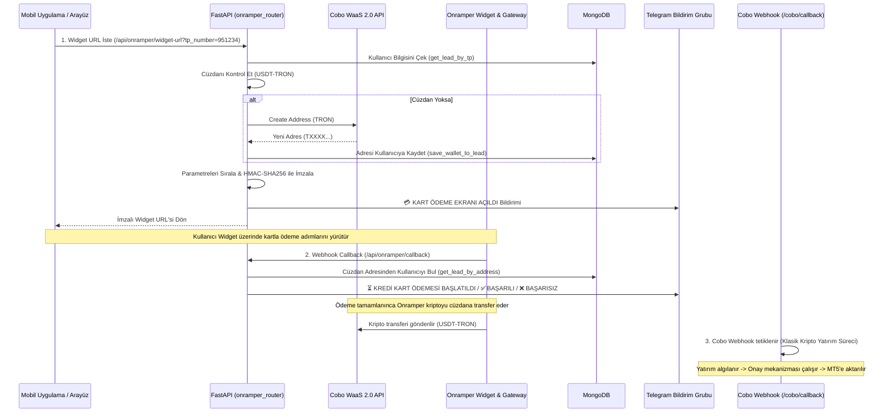

# 💳 Onramper Entegrasyonu Nasıl Çalışır?

Bu rehber, projedeki kredi kartı ile kripto para (USDT) satın alma altyapısını sağlayan **Onramper Fiat-Onramp** entegrasyonunu, URL imzalama (signing) güvenliğini ve webhook akışını açıklamaktadır.

---

## 📋 Genel İş Akış Şeması



---

## 🛠️ Detaylı Süreç ve Teknik İnceleme

### 1. Widget URL Üretimi ve İmzalanması (`/api/onramper/widget-url`)
Kullanıcının kredi kartı ile güvenli bir şekilde yatırım yapabilmesi için ona özel imzalanmış bir Onramper URL'si üretilir:
* **Cüzdan Kontrolü/Oluşturma:**
  * Sistem öncelikle kullanıcının `USDT` (TRON) cüzdan adresi olup olmadığını sorgular.
  * Eğer daha önce oluşturulmuş bir cüzdan adresi yoksa, arka planda Cobo API (`create_address`) tetiklenerek yeni bir USDT-TRON yatırma adresi oluşturulur ve MongoDB'ye kaydedilir.
* **Onramper Parametrelerinin Hazırlanması:**
  * `apiKey`: Proje `.env` dosyasındaki genel ortak anahtar.
  * `defaultCrypto`: `"USDT"`
  * `defaultFiat`: `"TRY"`
  * `defaultNetwork`: `"tron"` (TRC20 ağı)
  * `partnerContext`: Kullanıcının TP numarası (MetaTrader ID'si).
  * `wallets`: `USDT_TRON:{kullanici_adresi}` (Ödemenin yapılacağı hedef cüzdan).
* **Güvenlik - HMAC-SHA256 ile URL Signing:**
  * URL'in üçüncü şahıslar tarafından manipüle edilip hedef cüzdan adresinin değiştirilmesini önlemek amacıyla **URL Signing** (İmzalama) uygulanır.
  * Tüm parametreler alfabetik olarak sıralanır (`sorted(params.items())`) ve query string formatına dönüştürülür.
  * `.env` dosyasındaki `ONRAMPER_SECRET_KEY` kullanılarak query string'in **HMAC-SHA256** imzası oluşturulur.
  * Nihai URL bu imza eklenerek üretilir:
    `{ONRAMPER_WIDGET_URL}?{querystring}&signature={signature}`
* **Bildirim:** Kullanıcı bu ekranı açtığında Telegram grubuna `"💳 KART ÖDEME EKRANI AÇILDI"` mesajı atılır.

### 2. Onramper Webhook Callback Yönetimi (`/api/onramper/callback`)
Onramper widget üzerinde gerçekleşen işlemlerin durum değişiklikleri (kart onaylandı, işlem iptal edildi vb.) webhook callback aracılığıyla anlık olarak takip edilir:
* **Kullanıcı Eşleştirme:** Gelen callback payload'undaki `walletAddress` değeri MongoDB'de taranarak ilgili müşteri (lead) kaydı ve TP numarası bulunur.
* **Event Durumları ve Telegram Mesajları:**
  1. **`pending` / `paid` (Ödeme Başlatıldı):** Kullanıcının kart çekim adımına geçtiğini gösterir. Telegram'a `"⏳ KREDİ KART ÖDEMESİ BAŞLATILDI"` bildirimi atılır.
  2. **`completed` (Ödeme Başarılı):** Karttan paranın çekildiğini ve Onramper'ın kripto transferini başlattığını gösterir. Telegram'a `"✅ KART ÖDEMESİ BAŞARILI"` bildirimi gönderilir.
  3. **`failed` / `canceled` (Ödeme Başarısız):** Ödemenin reddedildiğini veya kullanıcı tarafından iptal edildiğini gösterir. `failedReason` bilgisiyle birlikte Telegram'a `"❌ KART ÖDEMESİ BAŞARISIZ"` bildirimi atılır.

### 3. Kullanıcı Arayüzü ve Frontend Akışı (`index.html`)
Kullanıcının kartla ödeme yapma süreci tamamen pürüzsüz ve interaktif bir ön yüz akışıyla tasarlanmıştır:
* **Sekme Geçişi ve Tetiklenme:**
  * Kullanıcı portala TP numarası ile giriş yaptıktan sonra üst menüdeki **"💳 Kart ile Yatır"** sekmesine tıklar.
  * Bu tıklama, `switchTab('card', this)` fonksiyonu üzerinden `loadCardPayment()` Javascript fonksiyonunu tetikler.
* **SweetAlert Loading Ekranı (UX):**
  * Asenkron backend istekleri sürerken kullanıcının sayfadan çıkmasını veya çift tıklamasını önlemek amacıyla **SweetAlert2** ile kilitli bir yükleme ekranı açılır:
    * *Başlık:* `"Ödeme Ekranı Hazırlanıyor..."`
    * *Açıklama:* `"Lütfen bekleyiniz, güvenli kart ödeme sayfasına yönlendiriliyorsunuz."`
    * *Özellik:* Dışarıya tıklanarak kapatılamaz (`allowOutsideClick: false`).
* **Asenkron İmzalı URL Talebi:**
  * Tarayıcı arka planda `fetch` API'sini kullanarak `GET /api/onramper/widget-url?tp_number={currentTP}` endpoint'ine istek atar.
* **Iframe'in Yüklenmesi ve Gösterim:**
  * Backend'den imzalı benzersiz URL başarılı bir şekilde alındığında:
    * Arayüzdeki iframe'in src'sine bu URL yerleştirilir: `document.getElementById('onramper-iframe').src = data.widget_url`
    * SweetAlert modalı kapatılır (`Swal.close()`).
    * `#step-card-show` adımı aktif hale getirilerek ödeme arayüzü ekrana basılır.
  * **Iframe Özellikleri:**
    * Iframe, portalın kart ödeme kartı içine gömülü responsive yapıda çalışır.
    * **600px sabit yükseklik** (`height: 600px`) ve **100% genişlik** ile sınırsız responsive esneklik sunar.
    * Arayüz şablonu:
      ```html
      <div style="background: white; padding: 0.5rem; border-radius: 20px; box-shadow: 0 4px 6px -1px rgba(0,0,0,0.1); margin-top: 1rem;">
          <iframe id="onramper-iframe" src="" style="width: 100%; height: 600px; border: none; border-radius: 16px;"></iframe>
      </div>
      ```

---

## 🔗 Onramper ile Cobo Arasındaki Bağlantı (Para Akışı)

Onramper bağımsız bir ödeme sağlayıcıdır ancak sisteme cüzdan adresleri üzerinden entegre edilmiştir:
1. **Dönüşüm ve Gönderim:** Kullanıcı kredi kartıyla ödemeyi tamamladığında, Onramper arka planda Fiat para tutarını (TRY) kriptoya (USDT) çevirir ve kullanıcının Cobo cüzdan adresine (TRON ağından) gönderir.
2. **Kripto Yatırım Tetiklenmesi:** Kripto para Cobo cüzdanına ulaştığında, Cobo platformu bizim `/cobo/callback` webhook endpoint'imizi tetikler.
3. **Standart Yatırım Akışı:** Bu andan itibaren süreç, klasik kripto para yatırım akışına dahil olur:
   * Cobo Webhook İşleyicisi (`workers/webhook_processor.py`) transferi algılar.
   * Filtreleme, kur çevirisi ve kilit (try_lock_transaction) adımları uygulanır.
   * Telegram'a admin onay butonları (`ONAYLA/REDDET`) gönderilir.
   * Yetkili onayladığında MT5'e bakiye eklenir ve para otomatik olarak ana kasaya / convert cüzdanına sweep edilir.

---

## 📢 Telegram Bildirim Şablonları

### Ödeme Başlatıldığında
> ⏳ **KREDİ KART ÖDEMESİ BAŞLATILDI**  
>  
> **Ad Soyad:** Ahmet Yılmaz  
> **TP NUMBER:** `951234`  
> **Yöntem:** Credit Card  
> **Ödenen Miktar:** 3000 TRY  
>  
> *Ödeme işlemde. Onramper onayı bekleniyor...*

### Ödeme Başarıyla Tamamlandığında
> ✅ **KART ÖDEMESİ BAŞARILI**  
>  
> **Ad Soyad:** Ahmet Yılmaz  
> **TP NUMBER:** `951234`  
> **Yöntem:** Credit Card  
> **Yatırılan Tutar:** 3000 TRY (Kripto: 90.50 USDT)  
> **Hedef Adres:** `TXXXXX...`  
>  
> *Ödeme onaylandı! Kripto paranın Cobo cüzdanına geçmesi bekleniyor. Cobo cüzdana geçince otomatik olarak MT5 hesabına aktarılacaktır.*

---

## 🔗 İlgili Bağlantılar
* Cobo cüzdanlarının nasıl oluşturulduğunu incelemek için: [[Cuzdan_Nasil_Olusturulur]]
* Kripto transferlerinin Cobo webhook'uyla nasıl yakalandığını görmek için: [[Webhook_Bildirimleri_Nasil_Calisir]]
* MT5 bakiye aktarım ve onay süreçlerini incelemek için: [[MT5_Bakiye_Aktarimi_Nasil_Onaylanir]]

---
#group/waas #group/telegram #group/fiat
