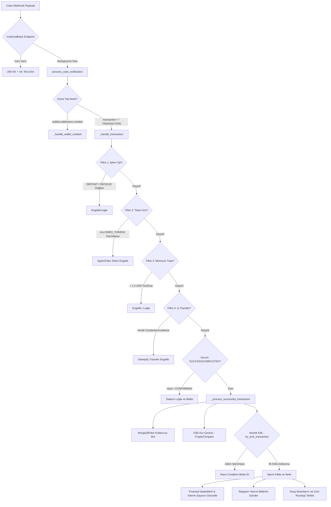

# 📥 Webhook Bildirimleri Nasıl Çalışır?

Bu rehber, Cobo platformundan gelen anlık kripto para transfer bildirimlerinin (Webhook) sistem tarafından nasıl karşılandığını, filtrelerden geçirildiğini, kilitlendiğini ve işlendiğini adım adım açıklamaktadır.

---

## 📋 İş Akış Şeması

---

## 🛠️ Detaylı Süreç ve Teknik İnceleme

### 1. Webhook Karşılama Endpoint'i (`/cobo/callback`)
* **Hızlı Yanıt İlkesi:** Cobo platformu, gönderdiği webhook isteklerine hızlıca yanıt verilmesini bekler. Aksi halde işlemi zaman aşımı (timeout) sayıp tekrar gönderir (retry). Bu nedenle API, gelen isteğin JSON verisini okur okumaz asıl ağır işi **FastAPI BackgroundTasks** kuyruğuna atar ve anında plain text `"ok"` (HTTP 200) yanıtı döner.

### 2. İşlem Filtreleri (Güvenlik ve Spam Önleme)
Gelen işlem bildirimleri `_handle_transaction` fonksiyonunda 4 aşamalı sıkı bir filtrelemeden geçirilir:
1. **İşlem Tipi Filtresi:** Sadece `DEPOSIT` veya `RECEIVE` türündeki işlemler kabul edilir. Para çekme (WITHDRAWAL) veya diğer engellenen tipler elenir.
2. **Spam/Fake Token Filtresi:** Kötü niyetli kişilerin cüzdan adreslerine spam olarak gönderdiği değersiz tokenleri engellemek için sadece `ALLOWED_TOKENS` sabitinde (USDT, USDC, TRX, ETH, BTC vb.) tanımlı gerçek kripto paralar işleme alınır.
3. **Hacim Filtresi (Dust/Toz Filtresi):** `BaseVolumeFilter.should_block_transaction` fonksiyonu, 12 Şubat 2026 tarihli manuel kur referans listesini (`BaseVolumeFilter.RATES`) kullanarak gelen miktarın USD değerini hesaplar. Eğer değer **1.0 USD** limitinin altındaysa işlem "toz" (dust) kabul edilip bloke edilir ve loglanır.
4. **İç Transfer Filtresi (Sweep Koruması):** Gelen işlemin `from_address` (kaynak) adresi, sistemdeki tüm cüzdan adreslerimizin listesiyle (`get_all_our_addresses()`) karşılaştırılır. Eğer kaynak adres sistemin kendi cüzdanıysa, bunun bir sweep/consolidation (iç transfer) işlemi olduğu anlaşılır ve gereksiz MT5 bakiye eklemelerinin önüne geçmek için işlem engellenir.

### 3. Başarılı İşlemin İşlenmesi (`_process_successful_transaction`)
Filtreleri geçen ve statüsü başarılı (`COMPLETED`, `SUCCESS`, `CONFIRMED`) olan işlemler için şu adımlar uygulanır:

* **Müşteri Eşleştirme:** İşlemin geldiği cüzdan adresi MongoDB'de aratılır (`get_lead_by_address`). Eşleşen bir müşteri (lead) kaydı yoksa uyarı verilip işlem durdurulur.
* **Kur Çevirisi (`coin_parser`):** CryptoCompare API'si asenkron olarak çağrılarak gelen coin miktarı anlık kurlarla USD değerine dönüştürülür. Stabil coinler (`USDT`, `USDC`) için API çağrısı yapılmaz, doğrudan 1:1 oranla geçirilir.
* **Atomik İşlem Kilidi (`try_lock_transaction`):** Race condition (aynı bildirimin aynı anda birden fazla işlenmesi) riskini ortadan kaldırmak için MongoDB düzeyinde tamamen atomik bir kilit mekanizması kullanılır.
  * `db.transactions` koleksiyonunda `transaction_id` alanı **Unique Index** ile korunmaktadır.
  * `$setOnInsert` ve `upsert=True` kullanılarak tek bir sorguda işlem kaydedilir.
  * Eğer `result.upserted_id` dolu dönerse, bu kaydı sisteme ilk ekleyen işlemdir ve kilit başarılıdır. Boş dönerse, bu işlem daha önce işlenmiştir ve mükerrer işlem (double deposit) anında engellenir.
* **İstatistik ve Sayaç Güncellemesi:** Müşterinin toplam yatırım miktarı (`total_deposit`) artırılır. Yatırım sayısı (`deposit_count`) 1 artırılır. İlk yatırım ise MT5 açıklaması `DEPOSIT`, sonraki yatırımlarda `DEPOSIT-2` olarak atanır.
* **Telegram Yatırım Bildirimi:** Yatırım bilgileri ve MT5 meta verileri (yatırım uzmanı kodu ve referansı) ile formatlı "KRİPTO YATIRIM" Telegram bildirimi gönderilir.
* **Komisyon & Bekleyen Depo:** Komisyon hesaplanıp (`calculate_comision`), onay/ret süreçleri için işlem geçici olarak RAM tabanlı `pending_transactions` deposuna kaydedilir.

---

## 🔗 İlgili Bağlantılar
* Webhook onaylandıktan sonra MT5'e bakiye ekleme ve onay butonlarını incelemek için: [[MT5_Bakiye_Aktarimi_Nasil_Onaylanir]]
* Kripto paraların cüzdanlar arası yönlendirilmesini incelemek için: [[Coin_Routing_Nasil_Calisir]]
* Cüzdan adresi oluşturma akışını incelemek için: [[Cuzdan_Nasil_Olusturulur]]

---
#group/waas #group/telegram #group/coin-routing
